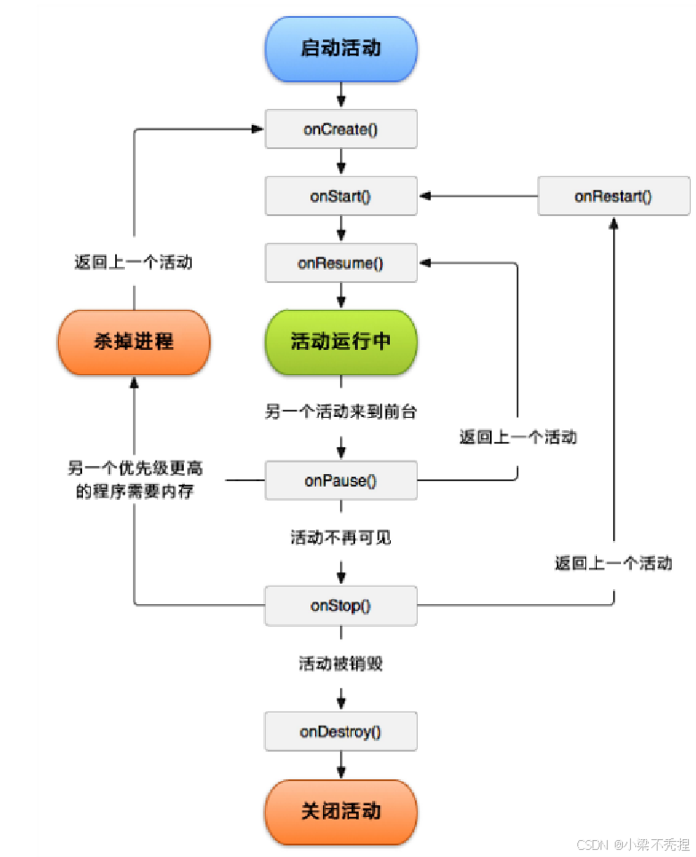
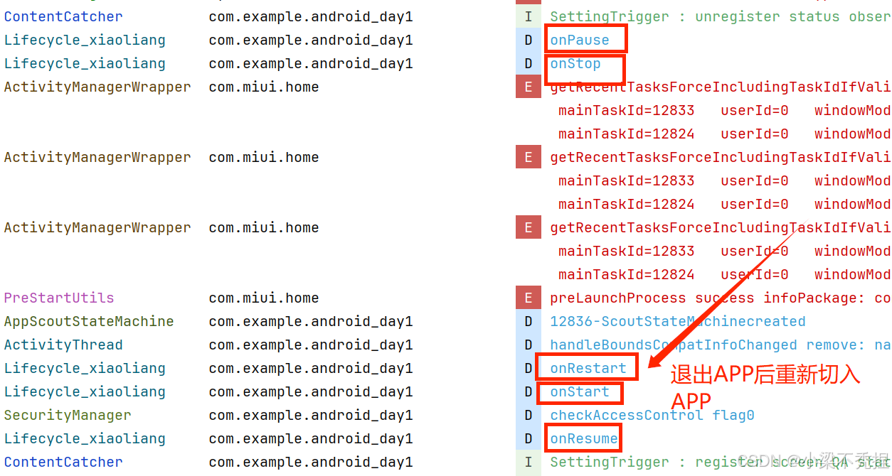
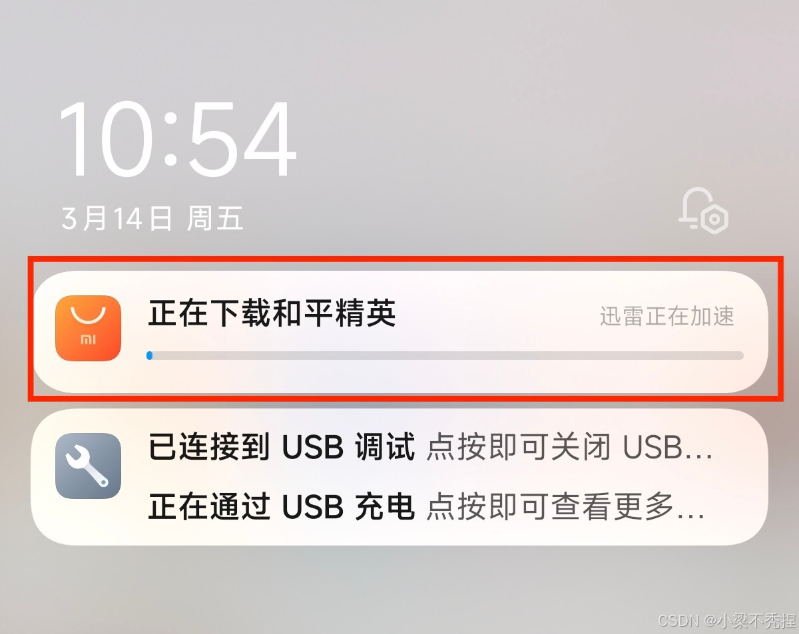
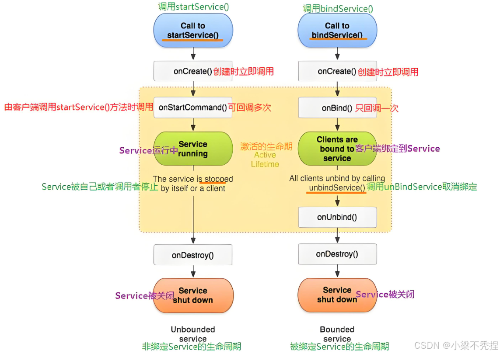
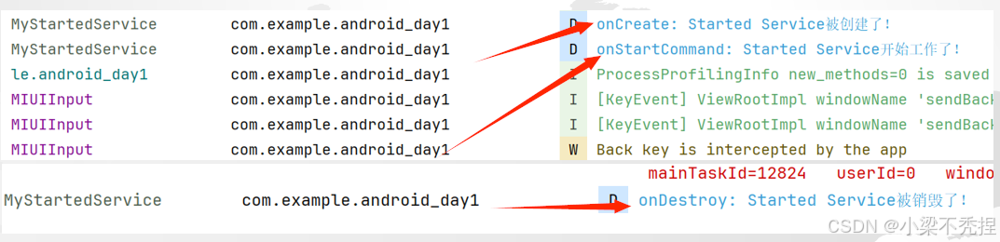
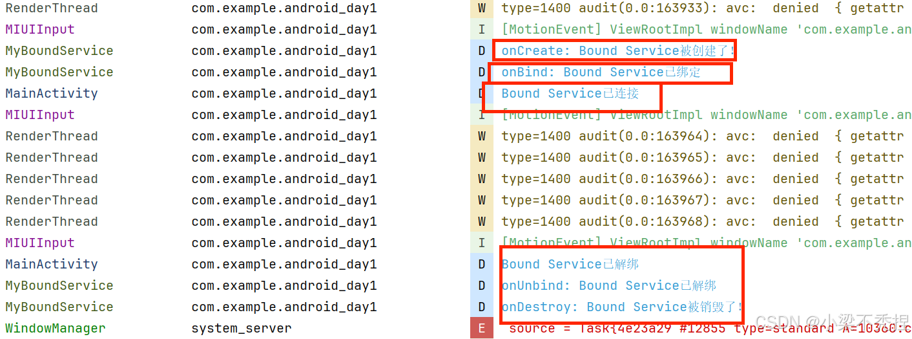
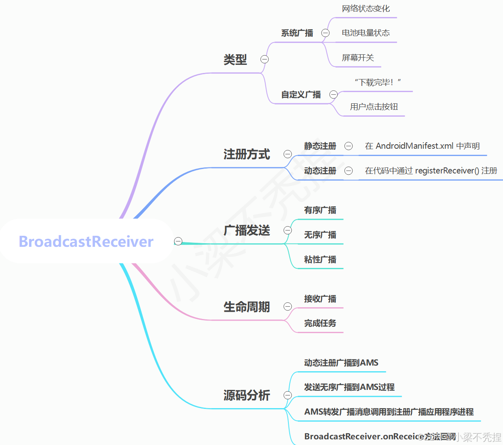

# Android四大组件学习

Android的四大组件包括：Activity（活动）、Service（服务）、BroadcaseReceiver（广播接收器）、ContentProvider（内容提供者）。

1. **Activity**：通俗来讲其实就是App上面用户看到的每个界面，Activity组件负责**界面展示、处理用户交互、进行数据传递**等
1. **Service**：无界面的后台组件，用于执行**长期执行**的操作。就比如说应用商城后台下载的东西、后台播放网易云音乐等
1. **BroadcaseReceiver**：手机里的“消息喇叭”，用于**监听系统或者应用发出的全局事件**的组件，比如说网络状态的变化，充电状态的变化等
1. **ContentProvider**：应用间的“数据共享存储桥”，是**管理跨应用访问**的组件，通过URL来标识数据，比如说我们的手机通讯录是不是可以被多个应用访问读取

## Activity(活动)

### 1.什么是Activity
Activity通俗来讲就是用户所看到每一个页面，是Android应用中用来展示用户界面的组件，我们可以通过它来进行应用程序的交互。

Activity可以想象成手机的每一个“页面”。比如当你打开一个App时，你看到的第一个界面就是一个Activity，这时你点击某一个按钮跳转到另一个界面就是另一个Activity。每一个Activity都是一个独立的界面，负责用户的交互和展示内容。

### 2.Activity的生命周期
Activity的生命周期包括以下几个关键方法：

1.**onCreate()**: Activity被创建调用。比如，当你点击QQ时，系统会创建QQ的MainActivity，并且调用OnCreate()这个方法。通常会在这里初始化界面和变量，这时候我们看到的界面是空白的。

2.**onStart()**：Activity即将可见时调用。比如，QQ的首页即将显示在屏幕上。

3.**onResume()**：Activity获得焦点，用户可以与之交互调用。比如，QQ可以完全显示出来，用户可以点击各种按钮来进行操作。

4.**onPuase()**: Activity失去焦点时调用。比如，用户按了Home键回到桌面或者跳转到了另外一个界面。

5.**onStop()**：Activity不再可见时调用，比如，你点击文章详情页进入到了文章里面。QQ的首页面被完全覆盖。

6.**onRestart()**：Activity从停止状态重新启动时调用。首页Activity从后台回到前台。

7.**onDestory()**：Activity被销毁时调用。比如，用户关闭了页面。

简单来说，将Activity的生命周期来比作人的一生，那么：

1.**oncreate()**：婴儿在母亲的肚子里，这时候别人还看不到婴儿，但是婴儿已经开始被初始化了

2.**onStart()**：出生了，睁开眼，别人看可以看见我们了。但是我们还不会说话，不可以互动(也就是用户还不能跟界面进行互动)

3.**onResume()**：我们长大了，步入青年，开始学习工作跟社会接触（用户可以跟界面进行交互）

4.**onPuase()**：工作学习累了歇一会（Activity被部分遮挡（比如弹出了一个对话框）没有被完全遮挡还可以看到一部分）

5.**onStop()**：退休了（Activity被完全遮挡（比如说跳转到了另外一个Activity上）不再显示在屏幕上面）。

6.**onRestart()**：你决定重新开始工作（Activity从后台回到前台，准备重新显示）

7.**onDestory()**：生命的尽头，over掉了（Activity被系统销毁，释放资源）

### 3.Activity的生命周期示例

## Servive(服务)

### 1.什么是Service
可以把Service想象成一个“后台默默无闻的打工人”，它没有UI界面，默默的在后台干活，比如播放音乐、下载文件 、处理网络请求等。即使你退出了App，没有杀死后台，那么Service还可以继续运行。

简而言之，Service就是一个**无界面的后台组件**，用来执行需要**长期运行**的操作。

### 2.Service的类型
Service有两种类型：

1. **Started Service（启动式服务）**

* 特点：通过startService()启动，会一直运行，直到任务完成或调用stopSelf()

* 适用场景：执行一次性任务，比如下载文件、播放音乐

* 生命周期：onCreate()->onStartCommand()->onDestroy()

2. **Bound Service（绑定式服务）**

* 特点：通过bindService()启动，允许多个组件（比如Activity）绑定到同一个Service。当所有组件解绑后，Service会被销毁

* 适用场景：提供长期服务，比如后台计算、数据同步

* 生命周期：onCreate()->onBind()->onUnbind()->onDestroy()

### 3.Service示例

## BroadCaseReceiver（广播接收器）

### 1.什么是BroadCaseReceiver

可以把广播接收器想象成一个“收音机”，它的作用是监听系统或应用发出的“广播信息”，并在收到消息后执行相应的操作。

    比如：
    ·手机电量过低，系统检测到了，会发出一个“低电量“的广播，广播接收器可以接收到这个消息并提醒你充电。
 
    ·你下载了一个App，下载完成之后，系统会发出一个“下载完成的广播，广播接收器接收到这个消息之后会提醒你进行安装。

简而言之，广播接收器就是用来**接收和处理广播消息**的组件。

### 2.BroadCaseReceiver的类型

广播分为**两种**类型：

    （1）系统广播
    ·特点：由系统发出，比如电池电量低、网络状态变化、屏幕开关等。
    ·比如：
    ACTION_BATTERY_LOW:电池电量低。
    