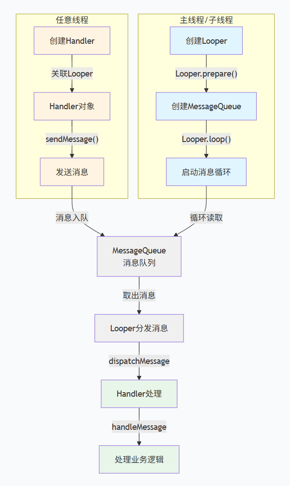
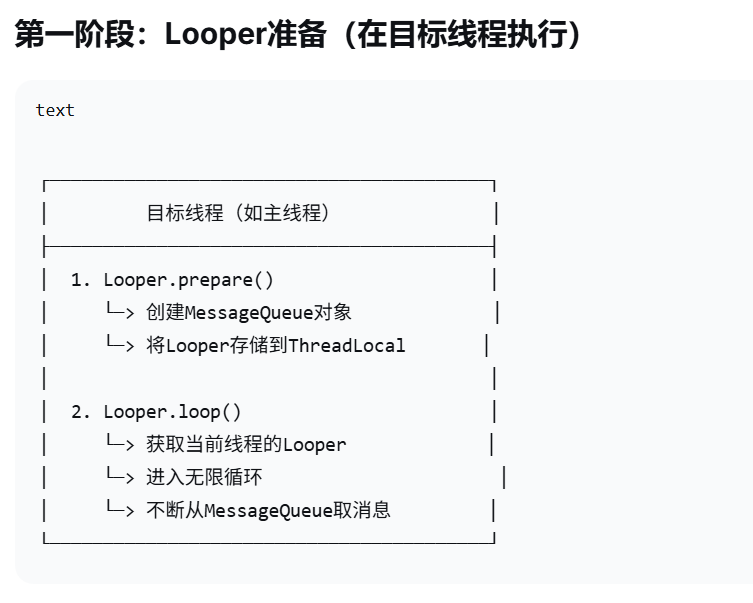
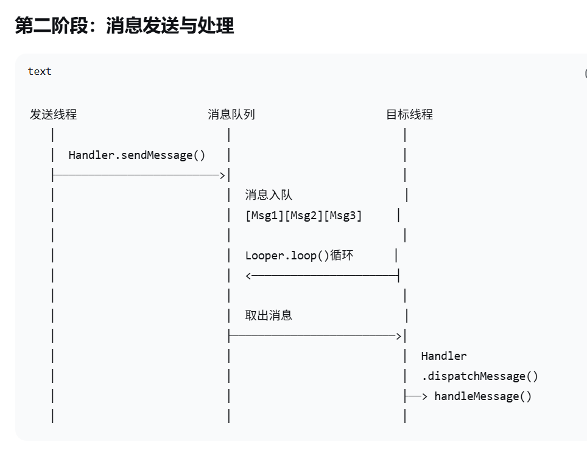

# Handler学习

在Android开发中，消息传递和线程通信是常见的需求。而Android的Handler机制就是用来实现这种消息传递和线程通信的重要组件。它在Android应用开发中扮演者至关重要的角色。

## 1.Handler组件

### Handler的重要性：

1.**线程间通信**：Android应用通常会涉及到多个线程的并发执行，而Handler机制提供了一种简单而高效的方式来实现线程间的通信。通过Handler，我们可以将信息发送到目标线程的消息队列中，并在目标线程中处理消息，从而实现线程间的通信和合作。

2.**异步消息处理**：在Android开发中，许多任务需要在后台线程中执行，完成后将结果更新到UI界面上。Handler机制允许我们在后台线程中处理任务，并通过Handler将结果发送到UI线程，以便更新UI界面。这种异步消息处理的机制在*保持UI的响应性和避免阻塞主线程*方面起到了至关重要的作用。

3.**定时任务处理**：Handler机制还可以用于处理定时任务。我们可以使用Handler的postDelayed()方法来延迟代码块或发送延时消息。这对于实现定时刷新、定时执行任务等场景非常有用。

### Handler应用场景：

1.**UI更新**：当后台任务完成之后，通过Handler机制将结果发送到UI线程，以更新UI界面，如显示加载完成的数据，更新进度条等。

2.**后台任务处理**：通过Handler机制，可以将后台任务发送到子线程来处理，避免主线程阻塞，从而保持UI的流畅性，如网络请求、文件读写等。

3.**定时任务**：通过Handler的定时任务功能，可以实现定时执行代码块或延时发送消息，如定时刷新、定时通知等。

4.**线程间通信**：通过Handler机制，在不同线程间发送消息和处理消息，实现线程间的通信和协作，如主线和后台线程之间的通信。

## 2.Handler机制概述

### Handler、Message和Looper的基本概念

**Handler**

Handler是Android中的消息处理器，它负责接收和处理消息。每个Handler实例都关联一个特定的线程，并与该线程的消息队列相关联。通过Handler，我们可以发送和处理消息，实现线程间的通信和协作。

**Message**

Message是Handler传递的消息对象，用于在不同线程之间传递数据。它包含了要传递的数据和附加信息，如消息类型、标志等。Message对象可以通过Handler的sendMessage()方法发送到目标线程的消息队列中，并在目标队列中被处理。

**Looper**

Looper是一个消息循环器，它用于管理线程的消息队列。每个线程只能有一个Looper对象，它负责循环读取消息队列中的消息，并将消息传递给对应的Handler进行处理。Looper的工作方式是不断从消息队列中取出消息，并通过handler的dispatchMessage()方法将消息分发给目标Handler进行处理。





工作原理:

    ·当一个线程需要使用Handler来处理消息时，首先要先创建一个looper对象，并调用其prepare()方法创建一个与当前线程关联的消息队列。

    ·接着，通过Looper的loop()方法启动消息循环，开始循环读取消息队列中的消息。

    ·当有消息通过Handler的sendMessage()方法发送到消息队列时，Looper会不断从消息队列中取出消息，并将其传递给对应的Handler处理。

    ·Handler在接收消息后，会调用自己的handleMessage()方法来处理消息。

## 源码结构

### 1.Handler的源码结构：

```java
public class Handler {
    private Looper mLooper;
    private MessageQueue mQueue;
 
    public Handler() {
        this(Looper.myLooper());
    }
 
    public Handler(Looper looper) {
        mLooper = looper;
        mQueue = looper.getQueue();
    }
 
    public void handleMessage(Message msg) {
        // 处理消息的逻辑
    }
 
    public final boolean sendMessage(Message msg) {
        return sendMessageDelayed(msg, 0);
    }
 
    public final boolean sendMessageDelayed(Message msg, long delayMillis) {
        if (msg.target == null) {
            msg.target = this;
        }
        return mQueue.enqueueMessage(msg, delayMillis);
    }
}
```

### 2.Message的源码结构

```java
public final class Message {
    public int what;
    public Object obj;
    public Handler target;
    // 其他成员变量
 
    public static Message obtain() {
        return new Message();
    }
}
```

### 3.Looper的源码结构

```java
public final class Looper {
    static final ThreadLocal<Looper> sThreadLocal = new ThreadLocal<>();
    MessageQueue mQueue;
 
    private Looper() {
        mQueue = new MessageQueue();
    }
 
    public static void prepare() {
        if (sThreadLocal.get() != null) {
            throw new RuntimeException("Only one Looper may be created per thread");
        }
        sThreadLocal.set(new Looper());
    }
 
    public static Looper myLooper() {
        return sThreadLocal.get();
    }
 
    public static void loop() {
        Looper me = myLooper();
        if (me == null) {
            throw new RuntimeException("No Looper; Looper.prepare() wasn't called on this thread.");
        }
        MessageQueue queue = me.mQueue;
 
        while (true) {
            Message msg = queue.next();
            if (msg == null) {
                return;
            }
            msg.target.dispatchMessage(msg);
            msg.recycle();
        }
    }
 
    public MessageQueue getQueue() {
        return mQueue;
    }
}
```

### 4.关系和协作机制

    ·