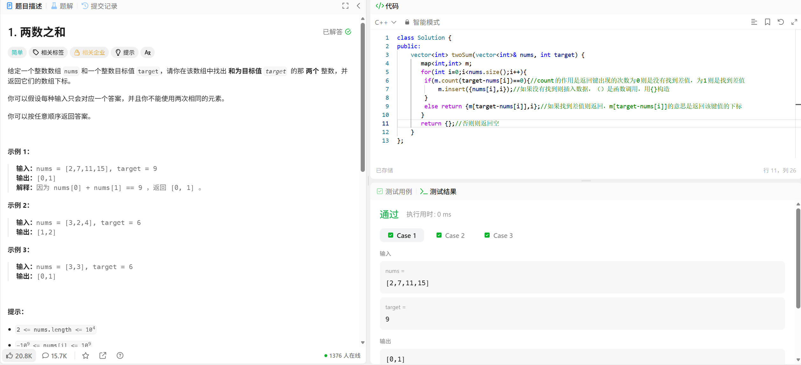

# LeedCode 1.两数相加


```C++
class Solution {
public:
    vector<int> twoSum(vector<int>& nums, int target) {
       map<int,int> m;
       for(int i=0;i<nums.size();i++){
        if(m.count(target-nums[i])==0){//count的作用是返回键出现的次数为0则是没有找到差值，为1则是找到差值
            m.insert({nums[i],i});//如果没有找到则插入数据，（）是函数调用，用{}构造
        }
        else return {m[target-nums[i]],i};//如果找到差值则返回，m[target-nums[i]]的意思是返回该键值的下标
       }
       return {};//否则则返回空
    }
};
```
