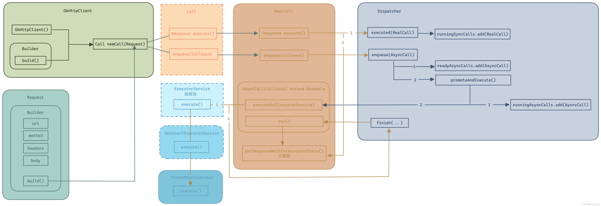
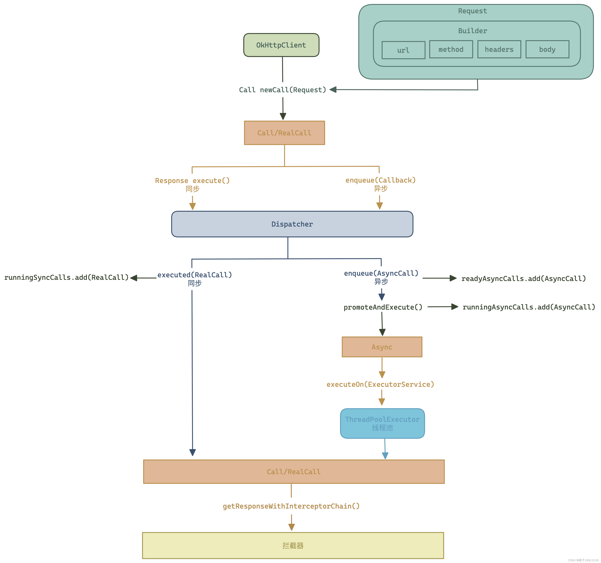

# 弄清楚Android的网络请求，OkHttp与Retrofit的区别与使用
目前主流的Android网络请求框架有OkHttp和Retrofit，不过Retrofit是对网络请求数据的封装，实际网络请求还是OkHttp进行，Retrofit其自身是不具备网络请求能力的。

## 1.OkHttp的概念
`OkHttp`它代替了HttpUrlConnection和Apache的HttpClient（用于发送和接收HTTP请求的客户端编程工具包）

---默认情况下OkHttp具有以下的特性：

·支持HTTP/2.0,HTTP/2.0是持久化连接，支持多路复用（客户端和服务端只有一个连接，通过一个连接可以发出多重请求）；

·连接池减少请求延时（连接池就是通过复用预先创建好的连接，减少系统在连接建立与销毁上的开销，从而提升程序性能和稳定性的技术）；

·透明的GZIP压缩下载大小（GZIP是网络传输中的“真空压缩技术”，它可以通过在服务器端压缩数据，在客户端自动解压，来大幅减小在数据传输量，从而让网络加载更快、更省流量）；

·缓存相应内容，避免一些完全重复的网络请求；

·网络出现问题之后，OkHttp能自动中恢复，如果服务器有多个IP地址，一个失败后，OKHttp会自动尝试连接其他的地址；


## 2.OkHttp的使用流程

在使用OkHttp进行请求时，首先要创建一个OkHttpClient的实例

``` kotlin
val client = OkHttpClient()
```

如果想要发起一条Http请求，就需要创建一个Request对象

```kotlin
val request = Request.Builder().url(url).build()
```

之后调用OkHttpClient的newCall方法来创建一个Call对象，并调用它的execute/enqueue方法来发送请求并获取服务器返回的数据（execute()方法是同步方法，enqueue()方法是异步方法）：

```kotlin
val response = client.newCall(request).execute()
```

response对象就是服务器返回的数据，可以使用下面的方法来得到返回的具体内容：

```kotlin
val responseData = response.body?.string()
```
其OkHttp的基本请求流程就是创建OkHttpClient()、Request()、Call(),接着调用OkHttpClient()的newCall().execute()/enqueue()来请求数据并获取数据
 

